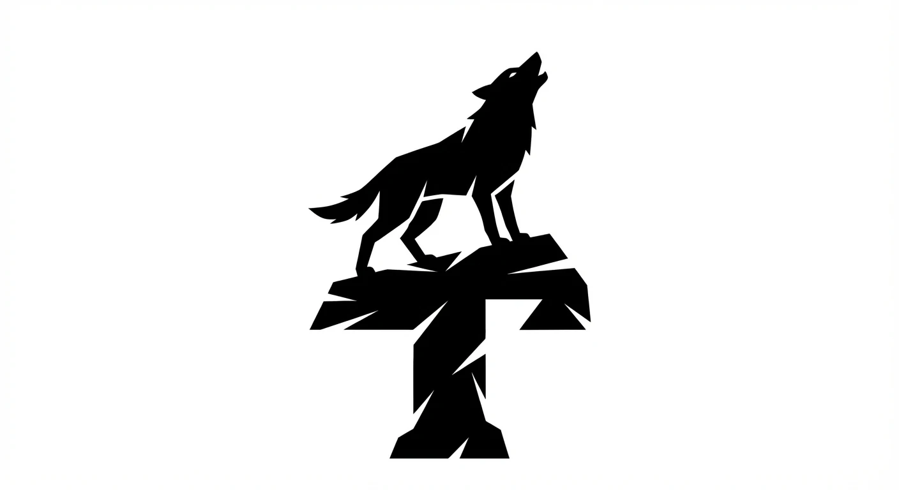

# ⚡ THUGH ORGANIZATION

### *Architecture in Silence.*

  <strong>Founded by Ali Kamrani</strong> 
  Software Developer • Prompt Engineer • Digital Architect • Builder of Meaningful Tools

  
  
  
  

---

## 🌍 Vision

Thugh Organization is an independent technology studio created by **Ali Kamrani** to design software that remains useful even under difficult conditions.

The goal is simple:

> **Build technology that empowers people, solves real problems, and leaves a meaningful legacy.**

This organization represents years of persistence, self-education, and engineering work developed through limited resources and challenging circumstances.

---

## 🏛 Core Philosophy

**Architecture in Silence** is the principle behind this organization.

It means creating systems quietly, consistently, and with purpose—allowing the quality of the work to speak louder than words.

Every project is built around three ideas:

* ⚙️ Practical usefulness
* 🧠 Intelligent design
* 🤝 Human impact

---

## 🚀 Areas of Innovation

* 🐍 Python Applications
* 🤖 Artificial Intelligence & Prompt Engineering
* 🖥 Desktop Software Development
* 🌐 Web Platforms
* 🔐 Security & Password Generation
* 📡 Resilient Communication Systems
* 🎨 Digital Product Design
* 🧰 Open Source Utilities

---

## 🧩 Featured Projects

### 🖼 Formato

A professional desktop studio for image conversion, PDF generation, watermarking, smart compression, and icon creation.

### 🔐 ThughLock

An advanced password generation system focused on secure and original password patterns.

### ☁️ Bara

A weather prediction and data visualization web application.

### 💬 DarkLine Messenger

A resilient communication concept designed for use in restricted-network environments.

---

## 🎯 Mission Statement

> We build software not for attention, but for impact.
> We design systems not for trends, but for endurance.
> We create quietly, and let the work speak.

---

## 📈 Current Objectives

* Expand open source software portfolio
* Develop AI-powered tools
* Build resilient communication technologies
* Publish engineering concepts and manifestos
* Establish Thugh as a recognized independent technology brand

---

## 🤝 Open Source Commitment

Thugh Organization believes that knowledge and tools should help others grow.

Many projects are released as open source to support developers, students, and creators around the world.

---

## 👨‍💻 Founder

**Ali Kamrani** is a self-driven developer and digital architect focused on Python, AI, prompt engineering, and practical software systems.

His work combines technical skill with a strong desire to create technology that remains useful, meaningful, and resilient.

---

## ⚡ "Build in Silence. Impact the World."

  

**© 2026 Thugh Organization — Crafted with purpose by Ali Kamrani**

